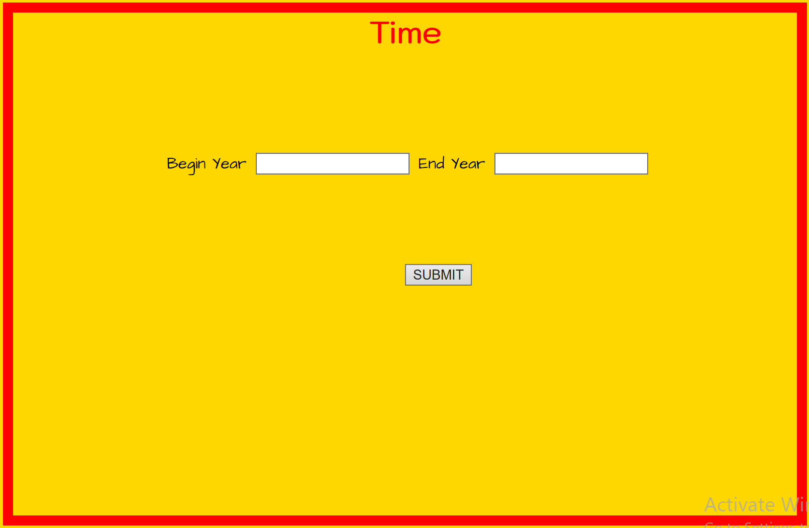
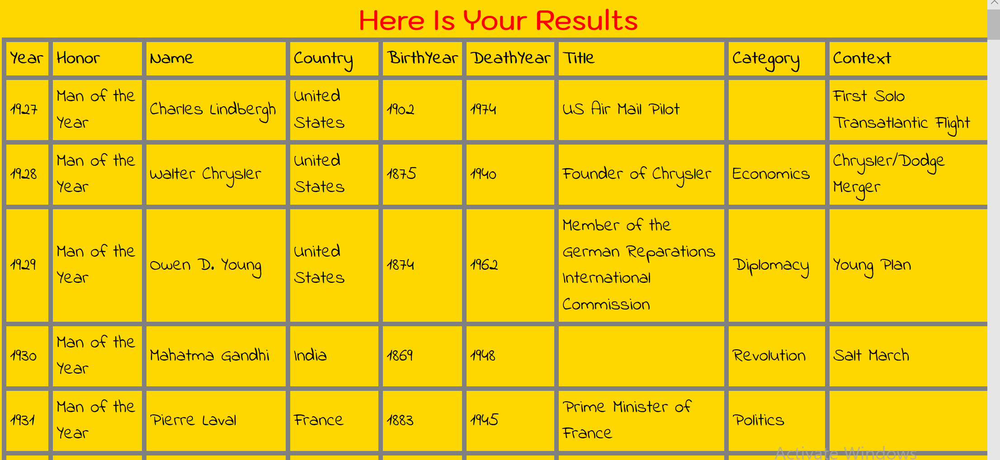

# lab11-FirstMVCApp
Use ASP.Net Core to create MVC APP

#Description

Provided is a csv file of all the “Time” Persons of the year from 1927 - 2016.

Create a web app that will allow a user to put in a span of 2 different years, and a list of all the winners will be returned.

#Visuals

 step1: Home page looks like this:

step2: type in the begin year and end year ,you will get result page, which looks like this:

